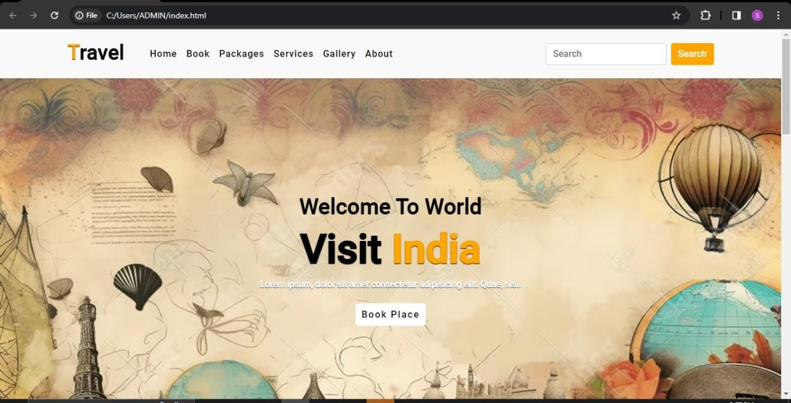

# Travel
Travel is the movement of people between distant geographical locations. Travel can be done by foot, bicycle, automobile, train, boat, bus, airplane, ship or other means, with or without luggage, and can be one way or round trip.Travel can also include relatively short stays between successive movements, as in the case of tourism.

## History
Travel by water often provided more comfort and speed than land-travel, at least until the advent of a network of railways in the 19th century. Travel for the purpose of tourism is reported to have started around this time when people began to travel for fun as travel was no longer a hard and challenging task. This was capitalized on by people like Thomas Cook selling tourism packages where trains and hotels were booked together. Airships and airplanes took over much of the role of long-distance surface travel in the 20th century, notably after the Second World War where there was a surplus of both aircraft and pilots. Air travel has become so ubiquitous in the 21st century that one woman, Alexis Alford, visited all 196 countries before the age of 21.

## Tourism
Tourism is travel for pleasure, and the commercial activity of providing and supporting such travel. UN Tourism defines tourism more generally, in terms which go "beyond the common perception of tourism as being limited to holiday activity only", as people "travelling to and staying in places outside their usual environment for not more than one consecutive year for leisure and not less than 24 hours, business and other purposes". Tourism can be domestic (within the traveller's own country) or international, and international tourism has both incoming and outgoing implications on a country's balance of payments.

## Steps to Run this code:
1.Clone this repository
2.Navigate to the project directory
3.View the code in any Text Editor
4.Open index.html in Web Browser
